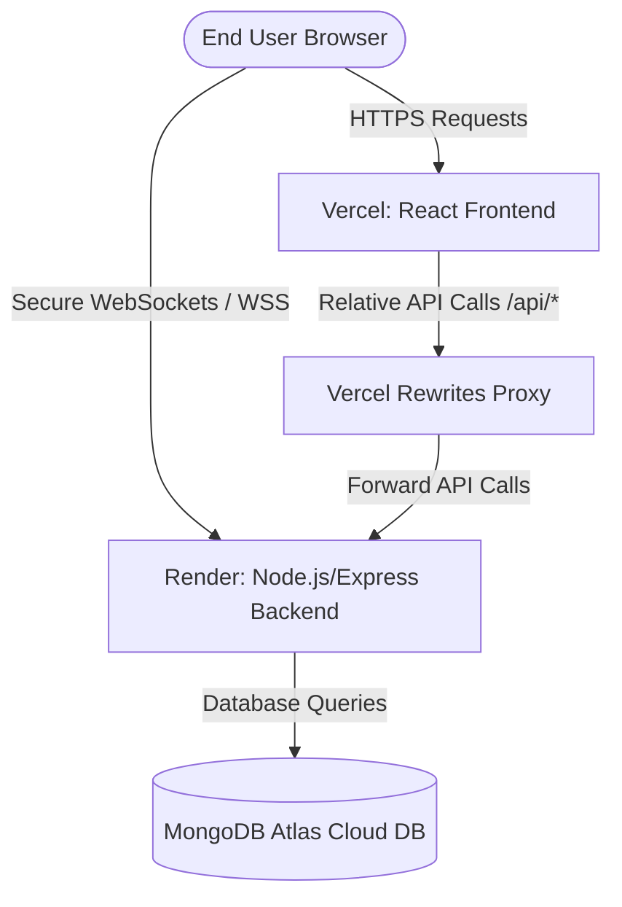

# IntellMeet - Production Deployment & Configuration Guide

This guide provides step-by-step instructions for deploying the IntellMeet application to production.

---

## 🏗️ Architecture Overview



---

## 🔑 Step 1: Set Up MongoDB Atlas (Database)

IntellMeet requires a MongoDB database. For production, use MongoDB Atlas.

1. **Sign Up/Log In**: Go to [MongoDB Atlas](https://www.mongodb.com/cloud/atlas) and log in.
2. **Create a Database Cluster**:
   - Click **Create** to deploy a new cluster.
   - Choose the **M0 Free Tier** (sufficient for standard deployment).
   - Select your preferred region (e.g. AWS / closest to your location).
   - Click **Create Cluster**.
3. **Configure Database Access**:
   - Navigate to **Security** > **Database Access**.
   - Click **Add New Database User**.
   - Set a **Username** (e.g., `db_user`) and select **Autogenerate Secure Password** or enter a strong password. Save these credentials.
   - Set privileges to **Read and write to any database**.
4. **Configure Network Access (IP Whitelist)**:
   - Navigate to **Security** > **Network Access**.
   - Click **Add IP Address**.
   - Click **Allow Access from Anywhere** (`0.0.0.0/0`).
   - *Reason*: Cloud hosting services like Render use dynamic IP addresses, so Atlas needs to allow incoming requests from any IP.
5. **Get Connection String**:
   - Go to your Cluster page and click **Connect**.
   - Select **Drivers** (Node.js).
   - Copy the connection string. It will look like this:
     ```
     mongodb+srv://<username>:<password>@cluster0.abc.mongodb.net/?retryWrites=true&w=majority&appName=Cluster0
     ```
   - Replace `<username>` and `<password>` with your database user credentials. Change the database name to `intellimeet` (insert it right before the `?` mark).

---

## 🚀 Step 2: Deploy the Backend API on Render

Render is recommended for Express servers using Socket.io because it supports persistent WebSocket connections.

1. **Create Account**: Sign up at [Render](https://render.com).
2. **Deploy Web Service**:
   - Click **New +** in the dashboard and select **Web Service**.
   - Connect your GitHub repository.
   - Configure the following settings:
     - **Name**: `intelmeet-backend`
     - **Root Directory**: `backend`
     - **Language**: `Node`
     - **Branch**: `main` (or your active branch)
     - **Build Command**: `npm install`
     - **Start Command**: `npm start`
     - **Instance Type**: `Free` (or higher)
3. **Configure Environment Variables**:
   - Click **Advanced** or navigate to the **Environment** tab of your service.
   - Add the following variables:
     | Key | Value | Description |
     | :--- | :--- | :--- |
     | `PORT` | `5000` | Internally listened port |
     | `NODE_ENV` | `production` | Enables production optimizations |
     | `MONGODB_URI` | `mongodb+srv://...` | Your MongoDB Atlas connection string |
     | `JWT_SECRET` | *Secure Random Hex* | Sign JWT tokens (e.g. run `node -e "console.log(require('crypto').randomBytes(32).toString('hex'))"`) |
     | `FRONTEND_URL` | `https://your-app.vercel.app` | Your deployed Vercel URL (Update this after frontend deployment) |
4. **Click Deploy**: Render will install dependencies and start the server. Copy the live API URL once done (e.g., `https://intelmeet-backend.onrender.com`).

---

## 🎨 Step 3: Deploy the Frontend on Vercel

Vercel is the ideal host for Vite/React applications.

1. **Create Account**: Sign up at [Vercel](https://vercel.com).
2. **Import Project**:
   - Click **Add New** > **Project** and select your GitHub repository.
   - Set the following configuration:
     - **Framework Preset**: `Vite`
     - **Root Directory**: `frontend`
     - **Build Command**: `npm run build`
     - **Output Directory**: `dist`
3. **Configure Environment Variables**:
   - Expand the **Environment Variables** section.
   - Add:
     | Key | Value | Description |
     | :--- | :--- | :--- |
     | `VITE_BACKEND_URL` | `https://intelmeet-backend.onrender.com` | Your live Render backend URL |
4. **Click Deploy**: Vercel will build the frontend and provide you with a production URL (e.g., `https://intelmeet.vercel.app`).
5. **Update CORS settings**: Go back to Render's environment settings and set `FRONTEND_URL` to this Vercel URL.

---

## 🛡️ Step 4: Security Configurations & SSL

The application has been configured with high-standard production security:

1. **Secure Headers (Helmet)**: Implemented using `helmet` to protect the backend from cross-site scripting (XSS), clickjacking, and mime-sniffing vulnerabilities.
2. **Rate Limiting**: Configured `express-rate-limit` on all API endpoints to limit each IP address to a maximum of 500 requests per 15 minutes to prevent DDoS/Brute-force attacks.
3. **Dynamic CORS Policy**: Configured in [server.js](file:///d:/Intelmeet/backend/server.js) to reject requests from untrusted origins, while dynamically allowing:
   - Your local development environments.
   - Your custom `FRONTEND_URL` environment variable.
   - Any Vercel preview/production deployments (`*.vercel.app`).
4. **SSL / HTTPS**:
   - **Vercel** and **Render** both automate SSL setup. They automatically issue and renew free SSL certificates via Let's Encrypt.
   - All backend routes `/api` and WebSocket protocols automatically use `https://` and `wss://` respectively.

---

## 🔎 Step 5: Verification & Testing Flow

Verify all features are working in production:

### 1. User Authentication
- Open the live Vercel URL in a browser.
- Go to `/login` and create a new account.
- **Verification**: Ensure you are redirected to the dashboard, and a unique avatar is fetched from DiceBear. Check MongoDB Atlas to see the new document in the `users` collection.
- Log out and log back in to verify the JWT token works.

### 2. Live Meetings & WebRTC
- Click **Instant Meeting** or **Start Meeting** from the dashboard.
- Copy the generated meeting code.
- Open a different browser in Incognito or use a separate device, log in, and click **Join Meeting** using the code.
- **Verification**: Verify both clients join the same meeting room. If camera/microphone access is allowed, check that WebRTC indicators show they are connected.

### 3. Real-Time Chat & Mentions
- Open the call chat panel inside the meeting.
- Send a message from one user to the other.
- **Verification**: Check if the message appears in real time.
- Mention another user using `@Username`. Check if a notification is generated and delivered in real-time.

### 4. File Uploads / Summaries
- Save notes during the meeting and generate a summary.
- If Cloudinary variables are configured, test uploading profile images or recordings and verify they load.

---

## 🛠️ Troubleshooting & Support

- **Database Connection Failure**: Verify that `0.0.0.0/0` is whitelisted in your MongoDB Atlas console under *Network Access*.
- **WebSocket Fails to Connect**: Ensure `VITE_BACKEND_URL` does NOT end with a trailing slash (e.g. `https://api.example.com` instead of `https://api.example.com/`).
- **Render Service Sleeps**: Render's free tier spins down services after 15 minutes of inactivity. The first API request after a sleep period may take 50–60 seconds to respond.
